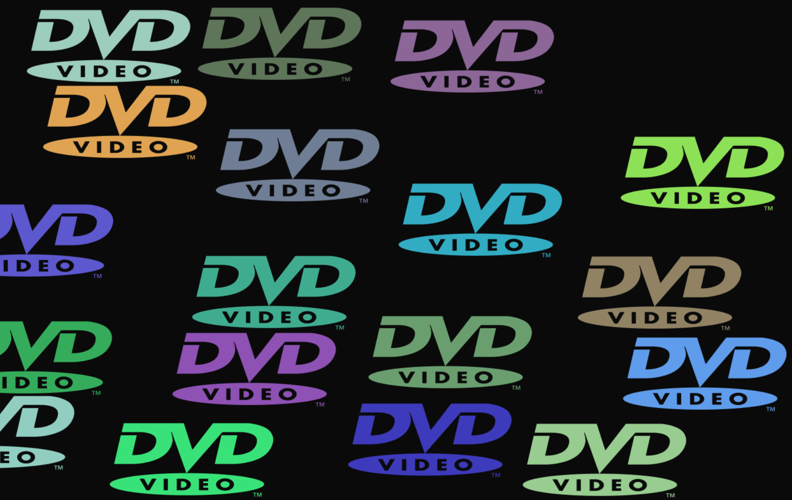

# Ultimate bouncing DVD logo simulator

[dvdlogosimulator.com](https://www.dvdlogosimulator.com)

A dose of nostalgia - watch the logo bounce around the screen and make sounds when it hits the edges. Users can spawn more logos, change the speed, and other settings!

I'm building this to get more familiarity with animation and also to try out Tone.js for audio (built on top of the Web Audio API).

I was inspired by [this python project](https://github.com/ARTEZON/Bouncing-DVD-Logo-Simulator) and also the awesome experiments in the [chrome music lab](https://musiclab.chromeexperiments.com/)

